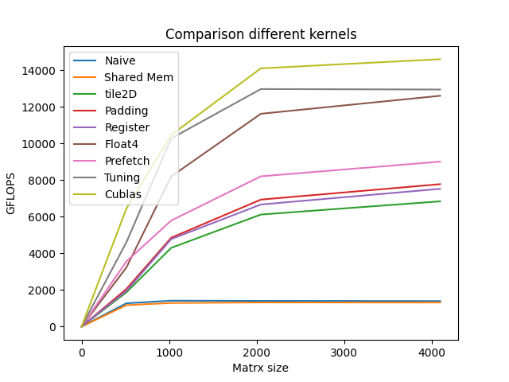

# SGEMM_Optimization
Running on NVIDIA GeForce RTX 3070 Ti

### GFLOPS at 4096x4096:
<!-- benchmark_results -->
| Kernels                              |  GFLOPS  | Performance relative to cuBLAS |
|:-------------------------------------|---------:|:-------------------------------|
| Naive                                |   `1395` | 1.3%                           |
| SMEM Method                          |   `1316` | 8.5%                           |
| 2D Tiling                            |  `6839`  | 12.8%                          |
| Solve Bank Conflicts (Padding)       |  `7776`  | 36.5%                          |
| Register                             | `7522`   | 69.7%                          |
| Float4                               | `12601`  | 70.8%                          |
| Float4 + Prefetch                    | `9006`   | 74.3%                          |
| Tuning                               | `12942`  | 78.4%                          |
| cuBLAS                               | `14597`  | 100.0%                         |
<!-- benchmark_results -->
